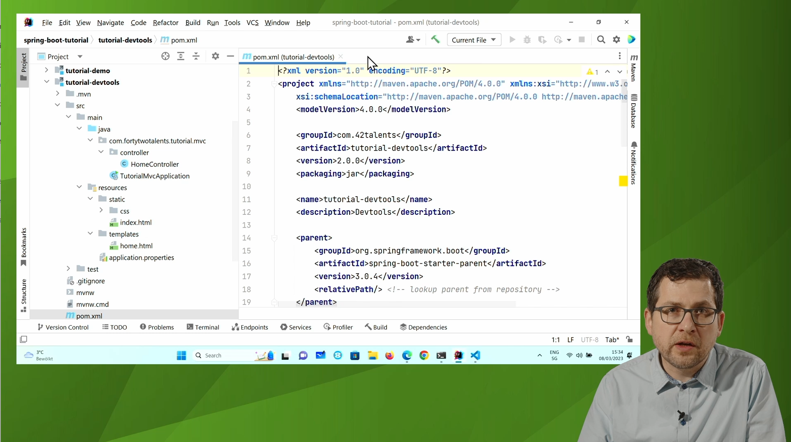

# Spring Boot 3 Tutorial

Mit Spring Boot 3 steht die dritte Generation eines Ecosystems zur Verfügung welches Entwickler:innen dabei unterstützt neue Applikationen im Handumdrehen zu erstellen. Mittels AutoConfiguration, Dependency-Management und weiteren Werkzeugen reduziert sich der Aufwand der markant. In diesem Tutorial zeigt Ihnen Patrick Baumgartner, wie Sie Java-Anwendungen effektiv mit Spring Boot und weiteren Projekten aus dem Spring Ecosystem entwickeln. Eignen Sie sich aktuelles Spring-Boot-Know-how an, um moderne Applikationen zu entwickeln.

Begleitmaterial zum Video-Tutorial in diesem [Repository](https://github.com/patbaumgartner/spring-boot-3-tutorial-entwickler.de).
